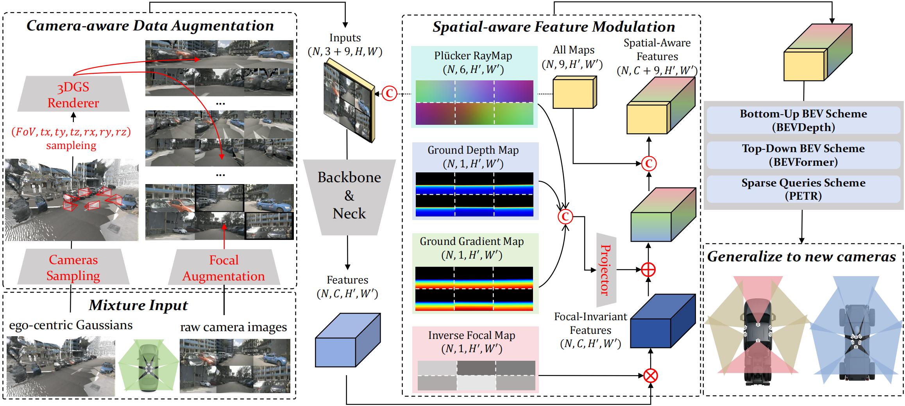

# CoIn3D: Revisiting Configuration-Invariant Multi-Camera 3D Object Detection



## Environment
Core packages installation:

**Step 0: install torch**
```bash
conda create -n coin3d python=3.8.5
pip install torch==1.12.1+cu116 torchvision==0.13.1+cu116 torchaudio==0.12.1 --extra-index-url https://download.pytorch.org/whl/cu116
```

**Step 1: install mmcv**
```bash
pip install mmcv-full==1.6.0 -f https://download.openmmlab.com/mmcv/dist/cu116/torch1.12.1/index.html
```

**Step 2: install mmdet**
```bash
pip install mmdet==2.28.0
```

**Step 3: install mmsegmentation**
```bash
pip install mmsegmentation==0.30.0
```

**Step 4: install mmdetection3d (editable mode)**
```bash
cd BEVDet
pip install -e .
```

**Step 5: install nuscenes-devkit (editable mode)**

We extend some API in official nuscenes-devkit to adapt Lyft and Waymo evaluation (We transform Lyft and Waymo to Nuscenes format for training and evaluation).
```bash
cd third_party/nuscenes-devkit/setup
pip install -e .

(optional)
pip uninstall numpy
pip install numpy==1.22.0
```

**Step 6: install 3D Gaussian Splatting Renderer Backend (editable mode)**
```bash
cd third_party/diff-gaussian-rasterization
pip install -e .
```

**Step 7: Other dependencies are flexible to choose**
```bash
pip install einops jaxtyping omegaconf spconv
```


## Data preparation
See [Data Preparation](./data_preprocess/README.md).


## Evaluation
We provide four checkpoints for evaluation, download them to `CoIn3D/BEVDet/ckpts`:

1. Mix trained on (Nuscenes + Waymo + Lyft), 3 classes (car, pedestrian, two-wheel). [Link](https://modelscope.cn/datasets/znkwong/CoIn3D_Data/resolve/master/ckpts/mix.pth), Metrics: [Nuscenes](BEVDet/ckpts/mix2n_metrics.md), [Waymo](BEVDet/ckpts/mix2w_metrics.md), [Lyft](BEVDet/ckpts/mix2l_metrics.md)

2. Trained on Nuscenes, car only. [Link](https://modelscope.cn/datasets/znkwong/CoIn3D_Data/resolve/master/ckpts/nuscenes.pth), Metrics: [Lyft](BEVDet/ckpts/n2l_metrics.md), [Waymo](BEVDet/ckpts/n2w_metrics.md) 

3. Trained on Waymo, car only. [Link](https://modelscope.cn/datasets/znkwong/CoIn3D_Data/resolve/master/ckpts/waymo.pth), Metrics: [Nuscenes](BEVDet/ckpts/w2n_metrics.md) 

4. Trained on Lyft, car only. [Link](https://modelscope.cn/datasets/znkwong/CoIn3D_Data/resolve/master/ckpts/lyft.pth), Metrics: [Nuscenes](BEVDet/ckpts/l2n_metrics.md) 

```bash
# Evaluate Nuscenes to Waymo/Lyft
bash tools/dist_test_nusc2x.sh

# Evaluate Lyft to Nuscenes
bash tools/dist_test_lyft2x.sh

# Evaluate Waymo to Nuscenes
bash tools/dist_test_waymo2x.sh

# Evaluate (Nuscenes+Lyft+Waymo) to Nuscenes/Waymo/Lyft
bash tools/dist_test_mix2x.sh
```

## Training
```bash
cd BEVDet
bash tools/dist_train.sh
```

## Citation

If you find our work useful in your research, please consider citing:

```latex
@article{kuang2026coin3d,
  title={CoIn3D: Revisiting Configuration-Invariant Multi-Camera 3D Object Detection},
  author={Kuang, Zhaonian and Ding, Rui and Wang, Haotian and Zheng, Xinhu and Yang, Meng and Hua, Gang},
  journal={arXiv preprint arXiv:2603.05042},
  year={2026}
}
```
